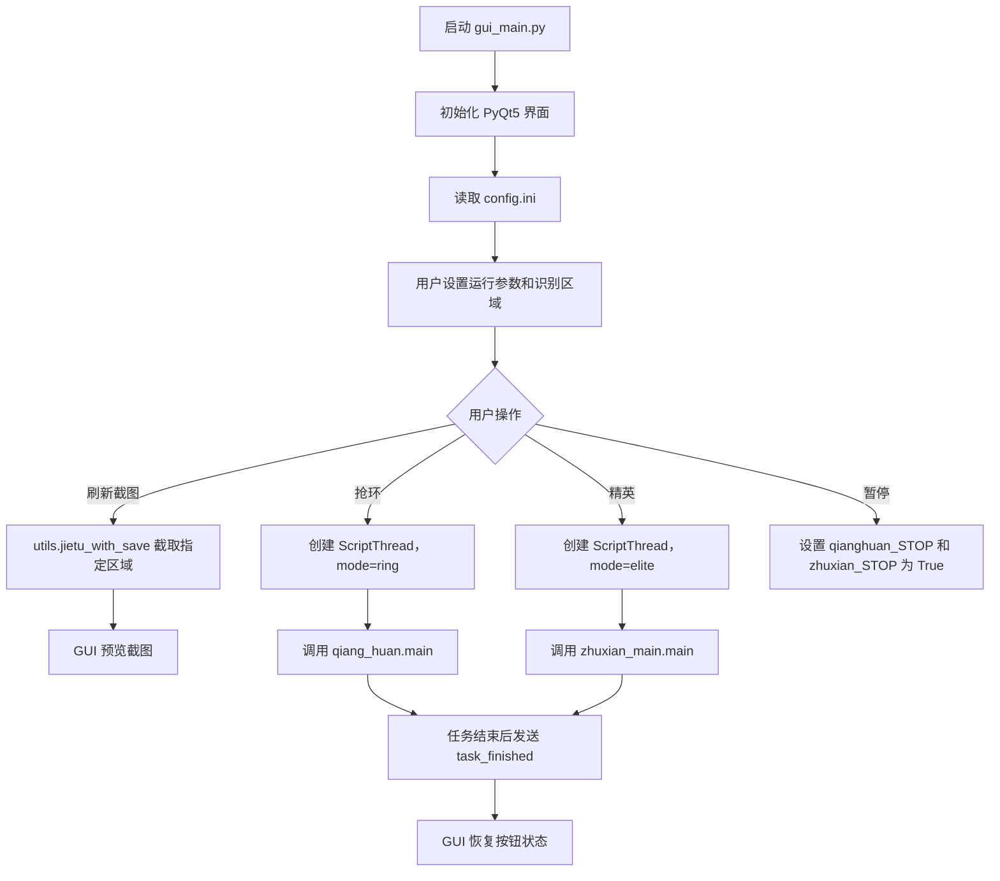
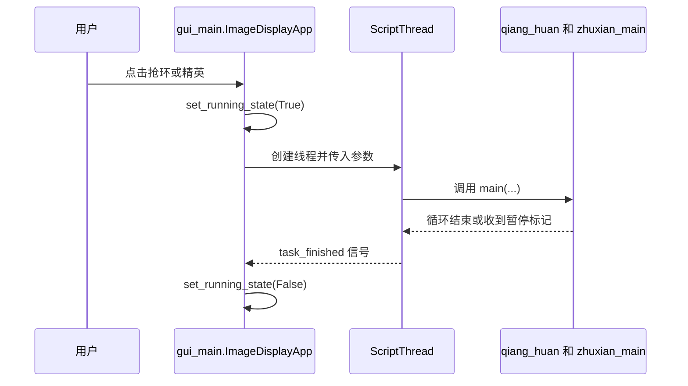
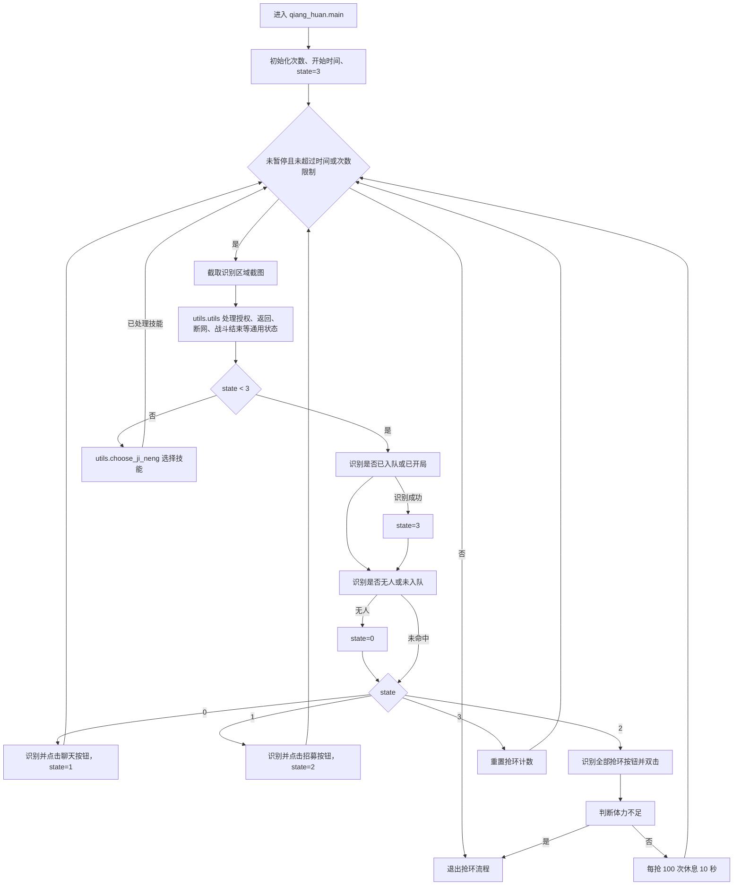
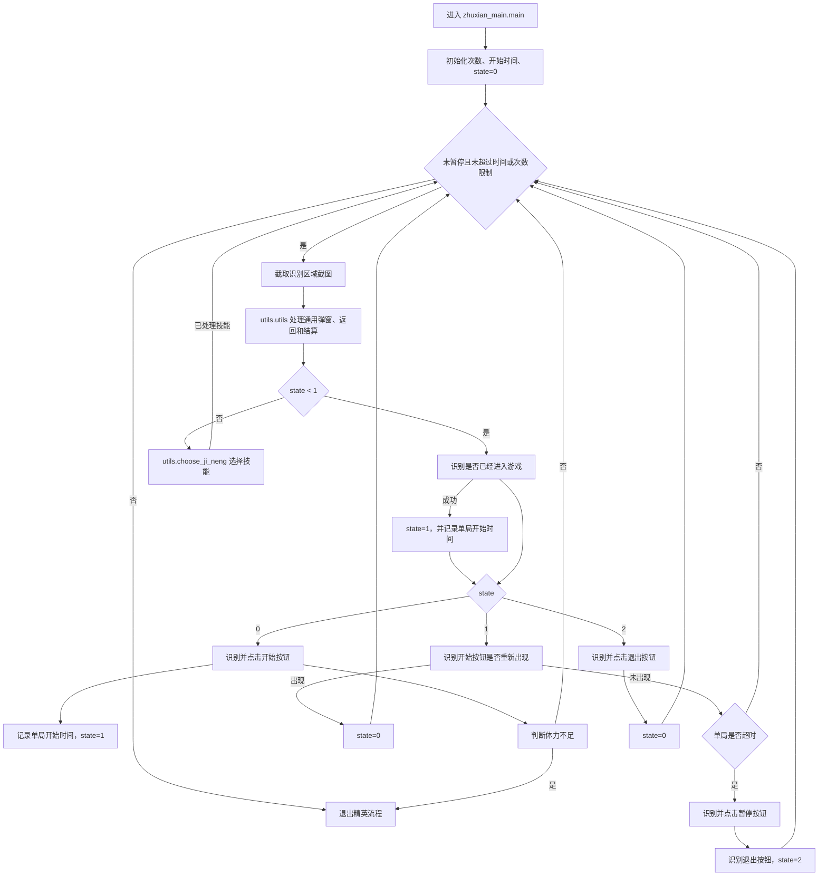
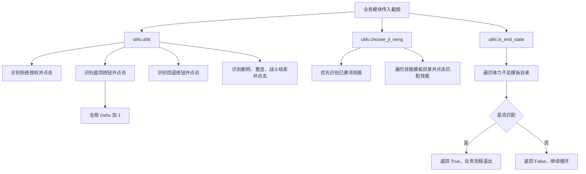
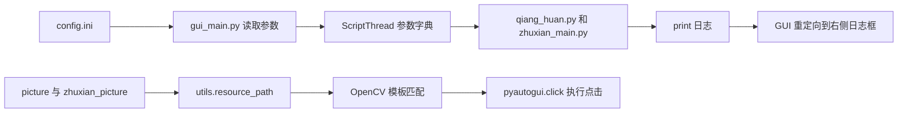

# 项目主要流程梳理

本项目是一个基于 Python 的游戏自动化工具。整体由 `gui_main.py` 提供图形界面，由 `qiang_huan.py` 和 `zhuxian_main.py` 执行两类自动化任务，底层依赖 `utils.py` 完成截图、OpenCV 模板匹配、点击和通用异常处理。

## 模块职责

| 模块/目录 | 主要职责 |
| --- | --- |
| `gui_main.py` | PyQt5 GUI 入口；读取/保存配置；启动、暂停任务线程；刷新截图预览；输出运行日志 |
| `qiang_huan.py` | “抢环/救援”自动化主流程 |
| `zhuxian_main.py` | “精英主线”自动化主流程 |
| `utils.py` | 资源路径适配、区域截图、模板匹配、通用弹窗处理、技能选择、体力不足判断 |
| `picture/` | 通用按钮、异常弹窗、技能、体力不足等图片模板 |
| `zhuxian_picture/` | 精英主线模式专用图片模板 |
| `config.ini` | GUI 参数持久化，包括运行时间、运行次数、任务耗时、截图识别区域 |

## 总体运行流程

## GUI 调度流程

`ImageDisplayApp` 负责界面和用户交互。用户点击“抢环”或“精英”后，GUI 会收集运行时间、运行次数、识别区域等参数，创建 `ScriptThread`，并在子线程中调用对应业务模块，避免阻塞界面。

## 抢环流程

`qiang_huan.main(limit_hours, region, limit_cishu)` 使用 `state` 管理流程：

- `state = 0`：未入队，查找并点击聊天按钮。
- `state = 1`：进入聊天后，查找并点击招募按钮。
- `state = 2`：查找所有抢环按钮并连续点击。
- `state = 3`：已入队或已开局，尝试选择技能。

## 精英主线流程

`zhuxian_main.main(limit_hours, region, limit_cishu, maximum_time_one_round)` 通过 `state` 管理自动开局、局内处理和超时退出：

- `state = 0`：在关卡页面，查找并点击开始按钮。
- `state = 1`：已进入局内，持续处理技能选择、返回按钮和通用异常；如果单局超过 `maximum_time_one_round`，点击暂停。
- `state = 2`：暂停菜单出现后，点击退出按钮并回到 `state = 0`。

## 通用工具流程

`utils.py` 是两个业务流程的公共底座：

## 关键退出条件

两个主业务循环都会在以下条件下退出：

1. GUI 点击“暂停”，设置对应全局停止标记。
2. 运行时间超过 `limit_hours`。
3. 完成次数 `utils.cishu` 达到 `limit_cishu`。
4. 识别到体力不足状态。
5. 精英主线单局超时后尝试暂停并退出当前局。

## 数据与资源流向

